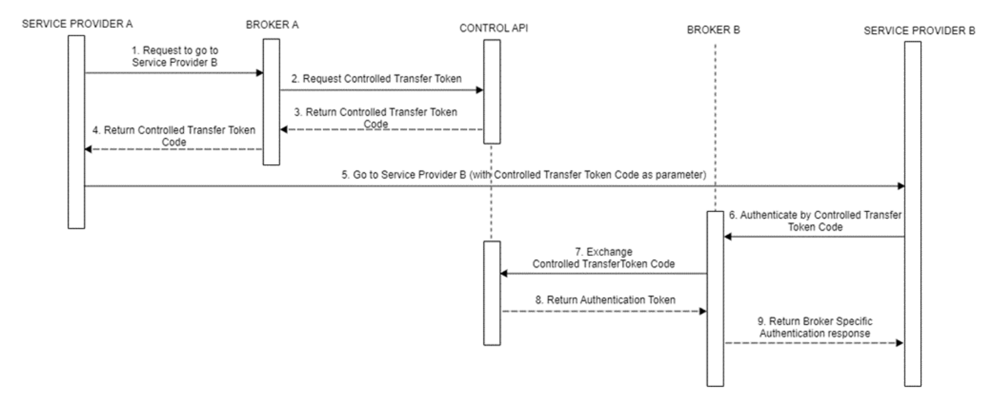
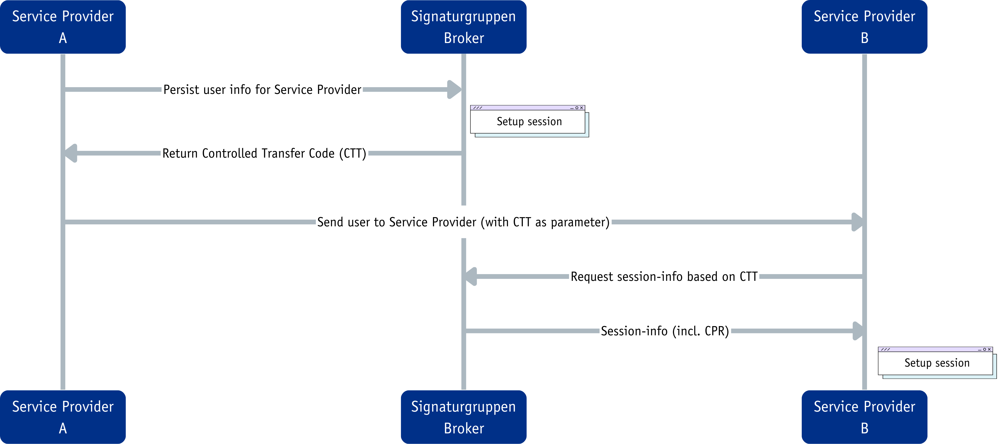

# MitID Controlled Transfer

## MitID Controlled Transfer Token (CTT)

### Overview
MitID Controlled Transfer Token (CTT) allows an authenticated session from one service provider (SP A) to be securely transferred to another service provider (SP B). This mechanism ensures authentication integrity is maintained and supports seamless session sharing.

### Process

#### Requesting a Controlled Transfer Token
- Service Provider A requests a Controlled Transfer Token (CTT) from Signaturgruppen Broker.
- Request:
  ```plaintext
  POST https://pp.netseidbroker.dk/op/api/v1/MitId/ControlledTransfer/tokenExchangeCode
  ```
- Headers:
  ```json
  {
    "Content-Type": "application/json",
    "Authorization": "Bearer {access_token}"
  }
  ```
- Body:
  ```json
  {
    "targetBroker": "{UUID of target broker}",
    "targetCVR": "{CVR of target service provider}",
    "transferTokenText": "some text"
  }
  ```
- The response includes a `transferTokenExchangeCode`, which must be passed to SP B.

#### Completing the Transfer at Service Provider B
- SP A redirects the user to SP B with the token.
- SP B exchanges the token at the broker endpoint:
  ```plaintext
  GET https://pp.netseidbroker.dk/op/connect/authorize?
  client_id={client_id}&redirect_uri={callback_url}&scope=openid mitid userinfo_token
  &response_type=code&state={state_value}&idp_values=mitid&idp_params={transfer_token_details}
  ```
- SP B receives an authentication response, completing the transfer.

### Flow Diagram

---

# Signaturgruppen Controlled Transfer

### Overview
Signaturgruppen Controlled Transfer provides a flexible session transfer mechanism between service providers. Unlike MitID Controlled Transfer, which has strict data transfer limitations, Signaturgruppens Controlled Transfer allows the sender to include any relevant data, provided they have obtained the necessary consent. Unlike MitID CTT, this method allows additional customization, including transferring user attributes beyond authentication details.

### Process

#### Creating a Controlled Transfer Token
- SP A initiates a request to Signaturgruppen Broker:
  ```plaintext
  POST https://pp.netseidbroker.dk/op/api/v1/controlledTransfer/create
  ```
- Request body:
  ```json
  {
    "targetTin": "DK000000000",
    "senderTraceIdentifier": "unique-trace-id",
    "claims": { "claimType1": "value1", "claimType2": "value2" }
  }
  ```
- The broker returns a **Controlled Transfer Token (CTT)**.

#### Exchanging the CTT for Authentication
- Signaturgruppens Broker ensures that only a secure API client from the specified target CVR can exchange the token. This guarantees that only the correct recipient can complete the transaction and verify the sender.
- SP B exchanges the received CTT for a valid authentication session:
  ```plaintext
  POST https://pp.netseidbroker.dk/op/api/v1/controlledTransfer/exchange
  ```
- Request body:
  ```json
  {
    "ctt": "{received_CTT}"
  }
  ```
- SP B receives authentication session details in a signed JWT token.

### Flow Diagram

---

### Consent Requirement
In Signaturgruppens Controlled Transfer, it is the sender's responsibility to ensure that the required consent has been obtained before transferring any data. Signaturgruppens Broker does not enforce or verify consent handling.

### Security Considerations
- Session data is based on the authentication at SP A.
- SP B should verify session details and consider additional user verification for sensitive operations.
- The transfer token has a short lifespan and can only be used once.

---

## Comparison of MitID CTT and Signaturgruppen Controlled Transfer

| Feature             | MitID Controlled Transfer Token (CTT)                   | Signaturgruppen Controlled Transfer                                                                           |
|---------------------|---------------------------------------------------------|---------------------------------------------------------------------------------------------------------------|
| **Purpose**         | Secure session transfer between SPs using MitID         | General session transfer with extended customization                                                          |
| **Broker Involved** | Signaturgruppen Broker                                  | Signaturgruppen Broker                                                                                        |
| **Data Transfer**   | Only authentication session (CPR cannot be transferred) | Can include user attributes (claims, etc.), but the sender must ensure appropriate consent for data transfer. |
| **Flexibility**     | Limited to MitID authentication flow                    | Can be adapted to various scenarios                                                                           |

---

## Summary
MitID Controlled Transfer Token (CTT) is a standardized method specifically for MitID session transfers, ensuring authentication integrity between service providers. On the other hand, Signaturgruppen Controlled Transfer offers greater flexibility, allowing the inclusion of additional user data and broader use cases beyond MitID authentication. Both methods ensure secure and efficient session transfers between service providers.

