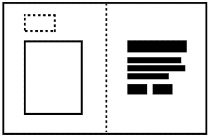

# Frondend guide
{: .no_toc }

- TOC
{:toc}


## UX assessment

You can integrate with the Signaturgruppen Broker using either a pop-up window or a full-screen browser redirect. Both methods provide equally secure user authentication. The choice between them depends on your preferred user experience.

> See the [GitHub .net core demo](https://github.com/Signaturgruppen-A-S/signaturgruppen-broker-demo) for example code

<table>
   <tbody>
      <tr>
         <th>
            <p><br><br></p>
            <h2><a id="_Toc110416978"></a>Pop-up UX assessment</h2>
         </th>
      </tr>
      <tr>
         <td>
            <ul>
               <li>Your existing page branding is visible behind the pop-up when displayed on PC. When used on mobile devices (including iPad) the popup opens in a new tab.<br></li>
               <li>Able to keep the UX state on the parent page</li>
               <li>With the pop-up the user has an extra browser window which incidentally can be closed or set the focus to the parent page. It’s recommended to handle those scenarios also to ensure a great user experience.<br></li>
               <li>Opening the pop-up with default size, might cause scrollbars if users with low vision resizes the text size.<br></li>
               <li>Some flows might require more space and are not suited for pop-ups.</li>
               <li>Not able to fully utilize Signaturgruppen Broker custom branding and layout theming.</li>
            </ul>
         </td>
      </tr>
   </tbody>
</table>

### Pop-up blocker compliance

Most browsers block pop-ups if they are called outside of user-triggered event handlers like onclick. Therefor it’s important to initiate the pop-up with onclick event. Some very aggressive pop-up blockers can still catch the pop-up.

We have tested this implementation with the following setups.

| Windows 10 | Chrome | Built-in pop-up blocker |
| --- | --- | --- |
| Windows 10 | Chrome | Popup blocker (strict),  <br>Chrome Extension\* |
| Windows 10 | Chrome | Popper blocker,  <br>Chrome Extension |
| Windows 10 | Edge | Built-in pop-up blocker |
| Windows 10 | Internet Explorer 11 | Default settings |
| Windows 10 | Firefox | Built-in pop-up blocker |
| Windows 10 | Opera | Built-in pop-up blocker |
| Windows 10 | Yandex | Built-in pop-up blocker |
| MacOS Catalina | Safari 13 | Built-in pop-up blocker |
| MacOS Mojave | Safari 12.1 | Built-in pop-up blocker |
| MacOS Mojave | Chrome | Built-in pop-up blocker |
| MacOS Mojave | Firefox | Built-in pop-up blocker |
| MacOS Mojave | Edge | Built-in pop-up blocker |

<table>
   <tbody>
      <tr>
         <th>
            <p><br><a id="_Toc64863080"></a><br></p>
            <h2><a id="_Toc110416979"></a>Redirect UX assessment</h2>
         </th>
      </tr>
      <tr>
         <td>
            <ul>
               <li>It can be initialized automatically on a page load. This makes it possible to have an absolute URL on your domain i.e., mydomain.dk/login that redirects to Signaturgruppen Brokers login. With the pop-up you need the onclick event, to ensure the pop-up is opened correct.</li>
               <li>Easier implementation with less JavaScript event handling.</li>
               <li>The entire screen is dedicated to the login experience and flow.</li>
               <li>Possible to setup custom branding, themes, and general layout via the Signaturgruppen Broker administration</li>
            </ul>
         </td>
      </tr>
   </tbody>
</table>

<table>
   <tbody>
      <tr>
         <th>
            <p><br><a id="_Toc64863080"></a><br></p>
            <h2><a id="_Toc110416979"></a>Fullscreen pop-up EX assessment</h2>
         </th>
      </tr>
      <tr>
         <td>
            <ul>
               <li>Same implementation as for limited size pop-up</li>
               <li>A blend of both pop-up and redirect flow. It opens up in a new browser tab which allows fullscreen usage and can improve error handling in many circumstances as the initiaing webpage UX state can be maintained, even when the end-user closes the opened tab</li>
               <li>The entire screen is dedicated to the login experience and flow.</li>
               <li>Possible to setup custom branding, themes, and general layout via the Signaturgruppen Broker administration</li>
            </ul>
         </td>
      </tr>
   </tbody>
</table>

## Branding

We support a wide range of options to customize the branding and UX experience of Signaturgruppen Broker. In our administration interface, it’s possible to setup multiple UX profiles for your services. Each UX profile will be based upon a set of base layouts, where you can tailor it to your need. With the UX profiles we take care of CSS, responsive behavior, and accessibility.

We support customization of:

- Background (solid colors and gradients)
- Logo
- A selection of texts
- Links

## Background behind the pop-up screen

To ensure the best user experience, we encourage you to make a pop-up backdrop on your webpage, that put focus to the pop-up. It could be an transparent color overlay or a graphical backdrop. It’s also recommended to implement support-text behind the pop-up, if the user minimizes or closes the pop-up unintended.


_Pop-up backdrop with support-text example_

# Theming

It’s possible to tailor the look and feel of the Signaturgruppen Broker to a great extent. In most cases it’s possible to create a broker theme that’s compliant with your company design guideline in the theme editor section of Signaturgruppen Broker Admin tool.

The themes are based upon a model where the foundation is a predefined base layout combined with multiple variables defining the specific theme.

It’s possible to have multiple themes for different purposes. By default, Signaturgruppen broker uses a built-in default theme that has a neutral look and feel. When you start working with themes, you need to access the Signaturgruppen Broker admin tool and go to the Theme menu item. If you don’t have access to this menu item, then contact your local administrator.

## Layout template

Every theme is based on a layout template, which define the structure of the page itself. It also handles the logic of the mobile responsiveness.

It’s possible to switch between layout templates without losing your personalized configuration with ex. colors, fonts.

Some features may be limited to certain layout templates.

The four predefined layout templates are the following:

### Basic

This is the default base layout. The IDP (ex. MitID) is aligned centered on the screen. There’s no option for soft content on this theme, so some of the theming options will be disabled for this theme.


### Split

In the base layout ‘Split’ the page is divided in two containers of equal width on larger devices. The IDP content and your company logo is visible on the left-hand column. Soft content is visible on the right-hand column. Both the IDP and the soft content is center aligned to the y-axis of the page. The client logo is fixed to the top left corner.  
On mobile devices the soft content is not visible. If you would like the soft content to be visible, please see the option for mobile top bar.



### Fluid Split

This layout template has a lot of things in common with Split. The big difference is that the two column isn’t split in equally sized columns. The left-hand column has a fixed size based on the IDP. The right-hand column will fill out the rest of the space.

On mobile devices the soft content is not visible. If you would like the soft content to be visible, please see the option for mobile top bar.


### Top bar

This layout template has a fixed top bar which spans the whole with of the page. The height of the top bar is fixed. Below the top bar you will find both the IDP and your soft content. The IDP and soft content is centered on page.

On mobile devices the soft content is not visible. If you would like the soft content to be visible, please see the option for mobile top bar.

_Please be aware: The layout template Top bar and the features Mobile top bar is two different things._


## Colors

Signaturgruppen broker support colors in many different formats: HEX, RGB and HSL.

Please note that print colors like CMYK and Pantone is not supported on screen devices. If you don’t have the needed color codes in the supported formats, you can try a tool like this <https://codebeautify.org/pantone-to-rgb-converter> or <https://www.cmyk2rgb.com/>.

You will find the color option in the “Colors” tab of your theme.

For background it’s possible to use both solid colors and gradients. Gradients is a color that goes from one specific color to another. For texts only solid colors is supported.

When you type in colors in the Signaturgruppen broker admin tool, you’ll see a preview of the selected color on a small preview.

When defining gradients, you have the option to let the colors change from top to bottom or from left to right.


After each color definition please press “Save” to save it to the theme.

### Fonts

In the font tab it’s possible to specify font related options to the soft content.

You can specify different fonts for heading and body text. All levels of headings will have the same font but can have different size and weight. There are three levels for headings in Signaturgruppen Broker. Heading, Subheading and Small subheading. They represent an H1, H2 and H3 on HTML page level.

It’s a good accessibility practice to have one heading(h1). The heading provides an important navigation point for users of assistive technologies, allowing them to easily find the main content of the page.

There are two web fonts available: Open Sans and IBM Plex Sans. IBM Plex Sans is the default font and the one used in MitID. Arial and Verdana are also available and rely on the installment of the user's machine. It’s also possible to specify and custom font in the input field, which also require that the font is present on the user’s machine. Therefor only use standard fonts.

Sizes can be defined in both px and rem/em. We encourage the use of rem for font size definitions because they scale very well for accessibility purposes.

A preview is displayed to the right of the font options. It doesn't reflect the actual soft content but a specimen that have all three headings and some body text.

_Please note, this will not affect the IDP but only the soft content._

### Logo

In the tab, logo, you can specify and URL to a hosted location of your logo.

The logo will be used in the size 150px \* 37px. If the format is .jpg, .png or .gif, we recommend that the image shall be of this size for best quality. We recommend the use of .svg for logo.

By default, the logo is hidden in mobile screen sizes. This ensures that the IDP is displayed with as little overflow on the y-axis as possible. To override this, you can suppress this behavior in the mobile customization tab.

If you don’t have the opportunity to host the logo file yourself, it’s also possible to specify a data:image/svg resource in the logo input field. This tool can be used to encode the file into and data property <https://yoksel.github.io/url-encoder/>

### SSN consent text

For SSN, Social Security Number, flows it possible to specify your own consent text. Danish, English and Greenlandic languages is supported. If a text is not specified Signaturgruppen Broker will use the default text defined by the broker.

Please note, if you don’t specify a text for a specific language the user will get the default text.

You find the options to specify custom SSN Texts in the tab: Text.

### Spacing

In the tab: spacing, you will find two different spacing options. The first one is a left side indentation and the second is in context spacing for the soft content.

Indentation of text can be defined in three relative sizes. If defines the spacing in which the soft content is indented. This spacing is adaptive to the viewport size, so for smaller size the spacing will automatically be smaller. Therefor there’s no option to enter an absolute value in pixel.

Spacing can be defined both px, em and rem. Rem is the default and recommended unit.

The small size is the default and can be extended to medium and large size.

Soft content sizing is defined in each datatype for the soft content.

Link collection direction defines if buttons in a link collection should be oriented from left to right or top to bottom.

The preview doesn’t reflect the actual soft content but is a specimen illustrating all the different types. Please verify the spacing on you own content.

Top spacing for first item and bottom spacing for last item is suppressed to ensure perfect center alignment.

_Please note that spacing on the button element is set in the button tab._

### Mobile customization

By default, the logo is hidden in mobile screen sizes. This ensures that the IDP is displayed with as little overflow on the y-axis as possible. To override this, you can toggle the ‘show logo’ feature to ‘always’ state.

Soft content isn’t visible on mobile devices by default to avoid the risk of overflow. It’s possible to enable a mobile top bar with a button for expanding the soft content. The background color of the top bar can be specified in either a solid color or a gradient. The background color of the expandable soft content area, is the secondary color defined in the color tab.

The design of the expand/collapse button in the top bar can be customized in the button tab under “Button In Top Bar”.

_Please note that the top bar is enabled with a responsive breakpoint, so it’s the screen size that defines if the device is a mobile device. Some wide phones and tables in landscape mode will not active the mobile view, hence there’s enough available space to show the content to the user._

### IDP selector

When multiple IDPs is enabled, the user is prompted with an IDP selector, where the user can select the IDP we want to use. The design of the IDP selector is based on two steps: startup, where the user makes the initial selection and an optional mini menu, where the user can re-select the IDP. Both options are possible to customize to some extent.

Each button is represented with the IDP logo on a button. The background, and hover background, of the button is customizable. We recommend using colors that have a contrast ratio of a minimum of 4.5:1 to be compliant with WCAG2.1 AA.

By default, there’s no outline border on the buttons. This can be enabled by setting a border thickness and color. When setting a border color, it’s recommended to also define a border color on hover.

The mini menu is disabled by default but can be enabled if needed.

IDP logos on the mini menu doesn't have a background color, so it’s important that the secondary content background is compliant with a contrast ratio of at least 4.5:1. It’s possible to revert the colors of logos to a negative version, where they are white. It's recommended to use the default colors whenever possible.

The mini menu has an isolated group of styling options.

### Buttons

Buttons consist of a complex set of styling options. There are three button types for soft content: primary, secondary and text link. All of them is available when defining soft content. Two system buttons for IDP and consent options. There are also options for styling the button for mobile top bar, if that is configured for the theme.

The primary system button is based on the MitID UX scheme and secondary system button is based on the NemID visual design.

_Please note that the buttons don’t affect the design of buttons inside MitID or NemID IDP._

### Custom Themes

The theming options in Signaturgruppen Broker is designed to cater for many different layout options. It’s also possible to get a completely customized theme, created by the developers of Signaturgruppen Broker. Contact us for more information about this option.

## Export / Import themes

It’s possible to export themes into a JSON file you can store on your machine or share with a colleague. The JSON file contains all the options chosen in the visual editor. The JSON file is ideal when moving themes between pre-production and production to minimize the risk of human errors.

The JSON file format has a built-in format version, to ensure that the file is compatible with the current state of Signaturgruppen Broker. Old files might not be compatible with the latest version.

## Assigning themes

Themes are assigned to services. By default, all services use the “Signaturgruppen Broker standard theme”. Go to the specific service and assign the theme you want to activate. It’s possible to have multiple themes that’s not active.

# Soft content

Soft content is optional texts and links that supports the user's journey. It's recommended to have soft content on Split, Split Fluid and Top bar theme templates.

Soft content is bound to the theme, so multiple soft content is possible with multiple themes.

Three languages is supported, Danish, English and Greenlandic. All languages contain independent content structures.

The content is found under the menu item ‘Texts’. If you don't have access to this menu item, please contact your local administrator.

## Input types

Multiple content types are available:

### Heading

Base headline, based on an html &lt;h1&gt; element. We recommend starting the soft content with a heading for accessibility reasons.

### Subheading

A smaller headline, based on an html &lt;h2&gt; element.

### Small subheading

An even smaller headline, based on an html &lt;h3&gt; element.

### Body text

Default paragraph text base on an html &lt;p&gt; element. Use this for the written content itself.

### Link Collection

A group of links. This can contain a single link or multiple links. Links can have three different styles: Primary, Secondary and Text link. Each button visual appearance is defined in the “Button” tab.

We recommend specifying alt (alternative) text for each link if the link name isn’t very specific. This ensures screen readers to be able to process the link optimal.

By default, the link opens in a new window. This can be suppressed by the “Open in the same window” toggle switch.

Please note, by default the links is placed besides each other. If you want them to be placed below each other, you have the setting in the “Spacing” tab.

## Preview

Preview functionality is building a preview with the theme options. This doesn't replace the need for proper testing in a browser.

## Export / Import soft content

It’s possible to export soft content structures into a JSON file you can store on your machine or share with a colleague. The JSON file contains all the content in all languages. The JSON file is ideal when moving themes between pre-production and production to minimize the risk of human errors.

The JSON file format has a built-in format version, to ensure that the file is compatible with the current state of Signaturgruppen Broker. Old files might not be compatible with the latest version.

# User Interface elements

## Accessibility

If the button or link for opening the Signaturgruppen Broker is anything else than an &lt;a&gt; or &lt;button&gt; element, you should add `role="link" tabindex="0"` to the DOM element, to make it accessible for keyboard navigation and screen readers according to the WCAG 3.0 standard.

We advise you to put helping text on functions that opens in a new window. You can use either of these two ways:

```
<!-- option 1 aria-label -->
<button aria-label="MitID sign in. Opens in a new window">Sign in</button>

<!-- option 2 visually hidden text -->
<button>Sign in <span class="visually-hidden">Opens in a new window</span></button>
<!-- visually-hidden class containing visibility:hidden in css -->

```


# MitID Button

  

<br/>If you want to use the MitID logo in a button as a Call-to-Action button (CTA buttons), then it must follow these specifications. The options for text on the MitID Button can be seen below. The options use the same action verbs as the action texts in the MitID box, but the text differs and does not include the name of the Service Provider. The action verbs and text on the MitID button must be one of the options shown below


