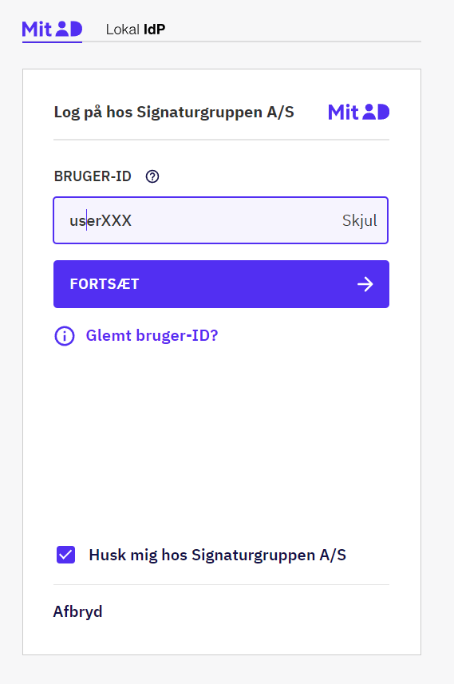
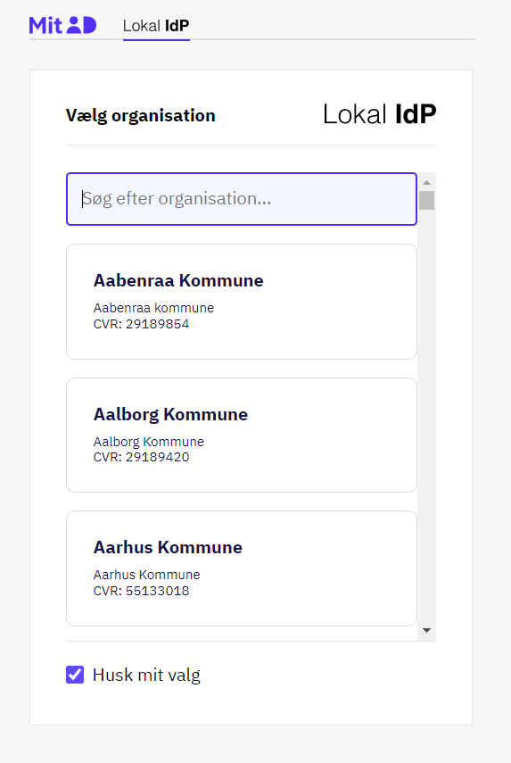

## MitID Erhverv

MitID Erhverv is the official digital business solution for companies, organizations, and authorities in Denmark.

More information is found here: <https://digst.dk/it-loesninger/mitid-erhverv/>.

### Supported OIDC parameters

| **Request parameter** | **Value** |
| --- | --- |
| idp_values | **mitid_erhverv** |

### Supported identity provider parameters (idp_params -> mitid_erhverv)

Note here, that if the user enters the MitID flow for authentication, the specific MitID identity provider parameters is applied to the MitID flow, see more in the MitID identity provider section for information on MitID.

| **Identity Provider parameters (mitid_erhverv)** | **Description** |
| --- | --- |
| allow_private | Type: Boolean, default: false<br><br>If set to true, then the user will be allowed to select to continue with this private MitID eID.<br><br>If no available professional identities are available for the user and the **allow_true** is set to true, then the private MitID identity is automatically selected. |

### Example JSON for identity providers (JSON URL encoded)

```json

{
  "mitid_erhverv": {
    "allow_private": true
  }
}

```

```

idp_params=%7B%E2%80%9Cmitid_erhverv%E2%80%9D%3A%7B%E2%80%9Callow_private%E2%80%9D%3Atrue%7D%7D

```

### Supported scope values

<table><tbody><tr><th><p><strong>Scope</strong></p></th><th><p><strong>Description</strong></p></th></tr><tr><td><p>nemlogin</p></td><td><p>List of claims:</p><ul><li>nemlogin.date_of_birth</li><li>nemlogin.email</li><li>nemlogin.name</li><li>nemlogin.family_name</li><li>nemlogin.given_name</li><li>nemlogin.nemid.rid</li><li>nemlogin.org_name</li><li>nemlogin.persistent_professional_id</li><li>nemlogin.cvr</li><li>nemlogin.se_number</li><li>nemlogin.p_number</li><li>nemlogin.cpr_uuid (for private service providers)</li><li>nemlogin.cpr (for public service providers)</li></ul></td></tr></tbody></table>

### ID Token identity claims

<table><tbody><tr><th><p><strong>Claim value</strong></p></th><th><p><strong>Possible values</strong></p></th></tr><tr><td><p>identity_type</p></td><td><p>professional</p></td></tr><tr><td><p>idp</p></td><td><p><strong>mitid_erhverv</strong></p></td></tr><tr><td><p>loa</p></td><td><p>Level of Assurance</p><p>One of</p><ul><li>https://data.gov.dk/concept/core/nsis/Low</li><li><a href="https://data.gov.dk/concept/core/nsis/Substantial">https://data.gov.dk/concept/core/nsis/Substantial</a></li></ul><p>The Nets eID Broker is a registered NSIS Substantial broker and thus cannot issue higher than Substantial.</p></td></tr><tr><td><p>ial</p></td><td><p>Identity Assurance Level</p><p>One of</p><ul><li>https://data.gov.dk/concept/core/nsis/Low</li><li>https://data.gov.dk/concept/core/nsis/Substantial</li><li>https://data.gov.dk/concept/core/nsis/High</li></ul></td></tr><tr><td><p>aal</p></td><td><p>Authenticator Assurance Level</p><p>One of</p><ul><li>https://data.gov.dk/concept/core/nsis/Low</li><li>https://data.gov.dk/concept/core/nsis/Substantial</li><li>https://data.gov.dk/concept/core/nsis/High</li></ul></td></tr><tr><td><p>amr</p></td><td><p>The list of authenticators used to achieve the resulting AAL/LoA.</p><p>Possible values are:</p><ul><li>mitid:password</li><li>mitid:code_token</li><li>mitid:code_reader</li><li>mitid:code_app</li><li>mitid:code_app_enchanced</li><li>mitid:u2f_token</li></ul></td></tr></tbody></table>

###

Transaction token MitID specific claims

<table><tbody><tr><th><p><strong>Claim value</strong></p></th><th><p><strong>Possible values</strong></p></th></tr><tr><td><p>mitid.reference_text</p></td><td><p>Passthrough of the MitID <strong>reference_text</strong> identity provider parameter.</p></td></tr><tr><td><p>mitid.psd2</p></td><td><p>The mitid.psd2 claim is always issued as a transaction token MitID specific claim.</p></td></tr><tr><td><p>transaction_actions</p></td><td><p>Type: string (single value) or JSON list</p><p>Only set, if one or more of the following transaction actions where performed:</p><ul><li>mitid.login (Login completed)</li><li>mitid_erhverv.identity_selected</li></ul></td></tr></tbody></table>

## Lokal IdP
MitID Erhverv natively supports the "Lokal IdP" setup as a built-in choice for end-users as part of the authentication experience for MitID Erhverv.

As illustrated by the pictures here, the MitID Erhverv flow has an extra tab that allows the user to search for the specific Lokal IdP of choice and Signaturgruppen Broker will handle the integration as part of the MitID Erhverv flow. 
The output of the flow is still an official MitID Erhverv identity.

MitID Erhverv default             |  MitID Erhverv Lokal Idp
:-------------------------:|:-------------------------:
  |  
