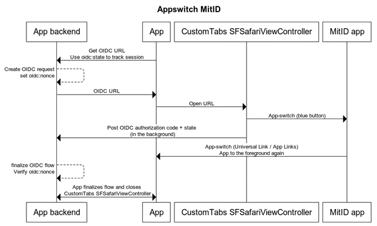

# Terminology

| **Term** | **Description** |
| --- | --- |
| Android Custom Tabs (**TAB**)<br><br>iOS SFSafariViewController (**TAB**) | The Android Custom Tabs and the iOS SFSafariViewController are a platform specific sandbox of the system default browser, which enables are more seamless and secure browser integration from native apps. |

# Introduction

This document is a technical guide for MitID app integration.

> DISCLAIMER: This document is the Signaturgruppen Broker recommendation for Android and iOS integrations for MitID, other options might be available. Signaturgruppen Broker does not provide general support for native app integrations. Use this document as a guide only.

## Supported browsers

MitID only tests and support the browsers that have at least 2% market share and thus it is a requirement, that app switch integrations on Android use Custom Tab targeting Chrome or the Samsung browser.

On Android it is possible to detect if Chrome or the Samsung browser is available before starting the Custom Tabs intent.

It is a security requirement that the end-user is presented with the address bar from the browser to allow the end-user to verify the **mitid.dk** domain during the MitID flow. It is not allowed to hide the address bar for the Custom Tabs or SFSafariViewController instances.

**Embedded browsers, i.e.WebViews, are not supported and not allowed – thus integrations must adhere strictly using to the Android Custom Tabs (Chrome or Samsung browser) or iOS SFSafariViewController (**TAB**) for all MitID integration flows.**

**MitID requires that the address bar is visible, such that the end-user can see the https and MitID domain when authenticating with MitID.**

For reference, see [Android Custom Tabs](https://developer.chrome.com/docs/android/custom-tabs) and [iOS SFSafariViewController](https://developer.apple.com/documentation/safariservices/sfsafariviewcontroller).

# OpenID Connect and app backend

The following is an example of how to implement the integration and is based on the approach recommended by Nets eID Broker – other options exist but be aware that Nets eID Broker does not provide a general support of app-integration variants.

It is highly recommended, and in many cases required, that an app-integration for MitID has a backend that can handle most of the OpenID Connect, security and API integration to the Nets eID Broker required for the full flow.

In broad terms, the flow can be described in the following way:

- All OpenID Connect (OIDC) handling is done by the app backend.
- The backend generates the initial authentication URL
- The app opens the authentication URL in TAB
- The end-user completes the MitID flow by app-switching to the MitID app by clicking the blue button in the MitID flow.
- When the flow is completed in the MitID app, the end-user is redirected back to the specified app-switch url, AppLinks / Universal Link handled, and is app-switched back to the app.
- The MitID flows are completed in the TAB and the app can complete the flow based on information received from the app backend or from the TAB.

## App backend handles all OIDC flows directly with the NEB API endpoints using a secure OIDC client

Only allowing the app backend to request the signed tokens and access the APIs on the NEB platform using a secure client strengthens the security of the setup. It is highly recommended, that both web- and app applications utilizes this approach to have no OIDC client configured client-side, but have the app-backend setup and handle all the specific integrations (except opening the browser with the generated OIDC URL).

## Custom Tabs and SFSafariViewController differences

The two implementations are in many ways identical, but with respect to the MitID app-switch integration, there are some key differences that affect how the general handling can and should be implemented.

## Custom Schemes

The TAB implementations do not offer the same control for the app as a standard WebView and does not offer any useful way for the app to get notified on redirects and URL changes in the browser.

The standard way to detect, complete and close the browser-flow in a TAB has been to utilize custom schemes, such as custom-scheme://oidc-redirect-url, to enable the browser flow to automatically generate an event in the app. This still works on iOS, but Chrome has begun to require user-interaction for this to work, which for most intends and purposes breaks this on Android.

## Part of app instance or not?

On iOS the SFSafariViewController is part of the app instance and thus when navigating from the TAB to the MitID app and back to the app using app-switch, the TAB will be in focus.

On Android the TAB can be started as “single-instance” or “single-task”, which affects the behavior. When choosing single-instance, the TAB is started as a separate instance, whereas with single-task, the TAB will be part of the app process. In both scenarios, the TAB will by default stay in the background when returning to the app via App Links app-switching and thus some handling is required here to get the TAB in the foreground again.

In both cases, the browser is still able to complete any flow in the background, if able and when the device is not running in power-saving mode. On Android the Custom Schemes transition can no longer be completed in the background, as this requires user-interaction.

The flow can in most cases be completed with the TAB in the background, but there are situations where it is required to have it in the foreground. It is also expected that the MitID client “finish” screen is shown in the browser to the user – so it is a general recommendation to show the TAB until the flows has completed.

## Android Custom Tabs getting back to the foreground

Direct app-switch back to the SP app will not automatically get the Android Custom Tab browser to the foreground, but instead puts the SP app activity that handles the app-switch in the foreground.

If the intention is to have the TAB to the foreground after the app-switch to the SP app, then it is possible to register an empty activity to handle the app-switch event from the return URL given to the MitID app flow and then let this activity close itself upon getting to the foreground based on this event. This will pop this activity and then get the TAB to the foreground. Here it is required to register the TAB as running in “single-task” mode.

# OpenID Connect and app-switch protocol

In this section the recommended protocol for both the OpenID Connect and the app-switch flows is described. The “old” ways of doing these kinds of integrations still works in iOS, as of writing, but we recommend doing the flow in the same way on both platforms and thus the restrictions on the Android platform are the primary driver for the following protocol description.

In broad terms, the protocol is visualized in the following sequence diagram:



It is crucial to have a backend for the app which can handle the OIDC and API specific integrations to the NeB platform and to be able to handle the split OIDC / app-switch flow which requires a little book-keeping and custom communication between the app and app backend.

It is assumed here, that the app and app backend can maintain a secure channel and that the app backend is able to verify that it is communicating with its own app and maintain a shared session / user context such that it is trivial for the app backend to map incoming OIDC codes and state to the correct app instance session.

### Step 1

App requests the OIDC authentication URL from the app backend. The backend generates the authentication URL with required and parameters. It is recommended the create signed requests.

Two vital OIDC parameters are of note here:

- State
- Nonce

The state parameter is echoed back together with the code parameter upon successful completion of the OIDC authentication flow and is typically used to get state or a state-identifier back with the code to map the flow to a specific session or similar use-case.

The nonce parameter is signed and imprinted into the ID token upon flow completion.

Thus, the state can be used to map to a user context and the nonce is used to verify that the received ID tokens are a result of the expected started flow.

Used together, these two parameters allow the integrating service to map the incoming OIDC code response to a specific user context and then verify that the nonce in the resulting ID token matches the expected nonce for that user and user context.

### Step 2

App opens the TAB with the URL received from the app backend. This will send the user to the system standard browser and initialize the MitID OIDC flow in-browser.

### Step 3

If the user is on a mobile platform and has the MitID app, the MitID client will render a blue app-switch button to the user and if clicked will app-switch to the MitID app.

The user will try to complete the MitID flow using one or more of his or her MitID authentication options.

### Step 4

The MitID flow completes.

The user might complete the MitID flow without app-switching to the MitID app, going to the app manually, or completing the flow using some of the alternatives to the MitID app. It is thus required to support the MitID flow without any involved app-switching. It is also a possibility that the user app-switches to the MitID app but that no automatic app-switch happens away from the MitID app back to the initiating app; this can happen when the app-switch functionality is not specified and activated by the integrating service provider.

So, the user will either complete the flow in-browser or being app-switched from the MitID to the initiating app.

In both cases, the app should detect, by an internal protocol between the app and app backend and/or by a direct TAB to app mechanism, that the flow has completed, as the app backend is able to complete the flow by the post-back received in the browser (with or without the user actively sitting in the browser). When the flow completes, the TAB is closed, and the authentication flow can be completed.

Note here, that because the user will in some scenarios complete the OIDC flow in-browser i.e., the browser is in the foreground for the last post-back step in the OIDC flow, the backend must display a webpage to the user here indicating that the flow has completed, and that the user will be sent to the app shortly. It is possible to render a “Get back to get app” button using Universal Links / App Links which enables the user to manually jump back into the app; but the app should detect when the flow is completed and close the TAB automatically; so the point of the last page is to let the user wait for flow completion, which in most cases will be (almost) instantaneously.

# OpenID Connect: handle the result

The crucial step here is to set the OIDC redirect_url parameter to an app backend https URL and set the form_post value for the flow response type for the app backend to be able to retrieve the OIDC code or errorcode directly from the browser instead of using the app as an intermediary for this communication.

The app backend will receive the final response in a format as follows:

```
redirect_url?code=xxxx&state=yyyyy
```

This enables the backend to complete the flow and then the app and backend to communicate to let the app know that the flow has completed. A proprietary protocol between app and backend is required here, which can be done using various methods, such as push messages and standard polling from the app.

Thus, the OIDC flow will complete in-browser and the issue is then to have the user get back to the app when the flow has completed.

It is possible to setup a button or other mechanisms that all require user interaction in the last step of the browser-flow, which enables the user to click and return to the app.

So, the backend must notify the app that the flow is completed, or the user must click on something, in order to escape the TAB and get back to the app. Note here, that this is the result of Chrome beginning to require user interaction on Custom Schemes redirects.

# MitID app-switch implementation and channel-binding

Starting with MitID release 11, in production from 06.06.23, the MitID app-switch functionality changes behavior, as the MitID setup introduces required channel-binding for all MitID flows.

The MitID channel-binding requires all MitID app flows to either app-switch to the MitID app or having the user scan a QR code inside the MitID client in the browser using the MitID app. Together with this, the blue app-switch button becomes available on all mobile devices when authenticating with MitID, in contrast with previous MitID versions where app-switch had to be enabled by the integrating service provider.

The blue app-switch button will be shown to the end-user on all mobile devices and allows the user to app-switch to the MitID app.

## App switch for non-app browser flows

MitID has introduced app switching for all mobile browsers and thus enabled that the user is able to app switch to the MitID app directly from a normal browser on a mobile device.

The implementation for this sends the user back to the device browser upon completion of the MitID flow in the MitID app.

This implies that when integrating to MitID from a SP App, it is required to setup the App Links / Universal Links URL as part of the integration to allow the MitID app to redirect to user to the SP App TAB browser instead of sending the user to the system browser.

Note, that if not specifying the return URL, as required, for App Links / Universal Link back to the SP App for the MitID flow, then the user will on some device/browser combinations end up in the device system browser decoupled from the started MitID flow and on some device/browser combinations complete the MitID app flow without being redirected further, but is then able to manually get back to the SP App. Be aware, that this does not work consistently across the different devices and flow combinations.

## Navigation stack issue with MitID app-switch

If app-switch is enabled with an app-switch from the MitID back to the service provider app, then the MitID app will in effect app-switch to, and not back-to, the service provider app and thus create an extra jump in the navigation queue of applications, as opposed to popping one.

This has little effect on the normal user experience, but will affect some app-switch scenarios and is worth considering in conjunction with the decision to enable/disable app-switch back to the service provider app.

If the app-switch chain between apps is longer than the one jump from the service provider app to the MitID app, the flow will work as intended. However, if the user app-switches from app1 to app2 to MitID app, then the app2 is unable to “pop” the navigation stack and return to app1, as in this case the “pop” will result in the user getting back to the MitID app again (the stack is app1 -> app2 -> mitid app -> app2).

As examples of “popping”: on Android some apps close themselves on success, as the NemID app on Android. On iOS you always have a “back arrow” in the upper left corner which gets you back to the caller. In the example above, clicking this back button in app2 after the MitID app-switch will result in getting back to the MitID app again.

# Setting up app switch

To enable app-switch, specify the platform specific return url/bundle ID and the running mobile platform (ios og android).

Example:

```
idp_params=%7B%22mitid%22%3A%7B%22enable_app_switch%22%3A%20true%2C%20%22app_switch_os%22%3A%22ios%22%2C%20%22app_switch_url%22%3A%22https%3A%2F%2Fyour.appswitch.url%2F%22%7D%7D
```

<table><tbody><tr><th><p><strong>Identity Provider parameters (mitid)</strong></p></th><th><p><strong>Description</strong></p></th></tr><tr><td><p>enable_app_switch</p></td><td><p>Type: bool. Default: false.</p><p>If true, enables MitID app switch for the flow.</p></td></tr><tr><td><p>app_switch_os</p></td><td><p>Type: string</p><p>One of the following values:</p><ul><li>ios</li><li>android</li></ul></td></tr><tr><td><p>app_switch_url</p></td><td><p>Type: String</p><p>Specify the Universal Link / App Links URL that your app can handle.</p><p>For non-signed OIDC requests, the URL must be whitelistet for your OIDC client.</p><p>NOTE: Currently the URL must point to the app association file for iOS or the app links JSON file for Android in the root of the domain. This might have been relaxed since the writing of this documentation which enables the flexible use of any registered URL.</p></td></tr></tbody></table>

# Enable returning from MitID app to the service provider App

## Android

To enable the MitID app to return to your SP app via App Links, you need to add an intent filter to your main activity in your Manifest.xml, as shown below:

```
<intent-filter android:autoVerify="true">
<action android:name="android.intent.action.VIEW" >
<category android:name="android.intent.category.DEFAULT" >
<category android:name="android.intent.category.BROWSABLE" >

<data
android:scheme="https"
android:host="App Links URL" />
</intent-filter>
```


Furthermore, you need to host an assetlinks.json file on your domain, and the domain should match the host in the manifest file.

See, <https://developer.android.com/training/app-links>.

## iOS

To enable the MitID app to return to an SP app, the SP needs to implement a Universal link. Which is done by hosting an apple-app-site-association file on a broker/service provider web site and register a matching associated domain in the app, see <https://developer.apple.com/ios/universal-links/>.
