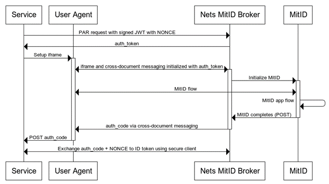

# MitID Iframe

## Introduction

This document describes the MitID iframe flow available as an alternative MitID flow.


## Iframe model

MitID supports a restricted iframe model that allows to complete the MitID flow within an iframe as alternative to the normal full-page or pop-up OpenID Connect flows.
The MitID iframe variant, is available as MitID reauthentication only, which requires the initiating service provider to have some form of authentication with the end-user when starting the MitID and is required to provide either the MitID UUID or the Danish CPR.

This model has several restrictions that includes

- Only the MitID app and code-display authenticators are available.
- Must be initialized with end-user MitID UUID or Danish CPR.
- Still requires MitID accepted browsers, the same list as for normal MitID, i.e. **embedded browsers are not allowed**.

But in return has some advantages as well

- Username input step skipped.
- MitID app-switch can be made automatic.
- No redirect or pop-up required.

The iframe variant is generally available to service providers, but can only be used when the service provider has an active authentication of the end-user, i.e. already knows who the user is before starting the flow.

It must be noted that the end-user MitID UUID or Danish CPR is part of the initialization of the flow and must be supplied as part of the input parameters to Nets eID Broker when starting an iframe flow.

## Nets eID Broker MitID iframe protocol

Overall, the flow will be handled by server-to-server API calls for initializing the flow and retrieving the signed ID token as well as setting up an iframe and communicating with Nets eID Broker through the iframe using cross-document messaging.

The following sequence diagram illustrates the overall flow.



- Service call API with signed JWT (must include NONCE)
- Service retrieves auth_token
- Iframe and cross-document messaging is setup using auth_token, flow initiates in iframe
- An auth_code is returned via cross-document messaging, this is POSTED from user-agent to service
- Service exchanges auth_code using secure client (secret/keys) from Token endpoint API.
- Service retrieves ID token. Validate ID token, see [Security section](https://signaturgruppen-a-s.github.io/signaturgruppen-broker-documentation/tech-security.html)

## Security considerations

- The auth_code has a short lifetime and can only be used once.
- When retrieving ID token with auth_code, the NONCE must match the NONCE used in the signed JWT to initiate the flow.
- ID token is constructed as for other NEB MitID flows, signed by the same HSM keys. The signing key is found in documentation and on the discovery endpoint.
- It is optional but recommended to sign the initialization request, as is done for signing Token endpoint requests, see [OIDC INTRO](https://signaturgruppen-a-s.github.io/signaturgruppen-broker-documentation/openid-intro.html)

## Short overview of flow steps

### 1) Initialize authentication flow

First step is to initialize the iframe authentication flow. This is done by invoking the following endpoint

```
[AuthorityUrl]/api/v1/iframe/initialize
```

This endpoint returns an authentication token used to initialize an authentication via the iframe setup.

The endpoint is invoked in the same manner as the Token endpoint using client secret, supporting the same formats for client info and client secret as the standard Token endpoint (OIDC and OAuth).

Additionally, information about the requested information is required, which is in the same format as a normal OpenID Connect request for the specified identity provider as for the standard OIDC flows through Nets eID Broker. See **\[NEB-INTRO\]** , **\[NEB-TECHREF\]**  and **\[NEB-IDP\]** for reference.

To control the available MitID authenticators, set the MitID specific parameter “authenticators”, to “app” for app-only and to “app code_token” to support both app and code token display.

It is required to allow the end-user to app-switch to the MitID app from the iframe, this is done by allowing/not restricting the opening of new pages from user-clicking in the iframe sandboxing parameters.

To enable the “minimized” mode, which better adapts the MitID client inside the iframe to small screen sizes, set the MitID specific parameter “iframe_mode” to "minimized".

Example:

```
curl --location 'https://pp.netseidbroker.dk/op/api/v1/iframe/initialize' \
--header 'Content-Type: application/x-www-form-urlencoded' \
--data-urlencode 'client_secret=[CLIENT SECRET]' \
--data-urlencode 'client_id=[CLIENT ID]' \
--data-urlencode 'response_type=code' \
--data-urlencode 'scope=openid mitid' \
--data-urlencode 'idp_values=mitid' \
--data-urlencode 'redirect_uri=[REDIRECT URI (Valid for client, use same for token endpoint later)]' \
--data-urlencode 'idp_params={"mitid": {"cpr_hint": "[CPR]", "iframe_mode": "minimized", "authenticators": "app code_token"}}'
```

And response:

```
{
  "auth_token": "string",
  "auth_token_expiration ": int,
  "iframe_url": "string"
}
```


### 2) Iframe flow

The iframe flow is started by setting up an iframe using the iframe_url from the initialize response and then providing the auth_token as messaging parameter, as described below.

_The current url for pp for MitID flows is:_ [_https://netseidbroker.pp.mitid.dk/iframe_](https://netseidbroker.pp.mitid.dk/iframe) _(subject to change, follow the “iframe_url” parameter)._

Messages sent from Nets eID Broker to the surrounding parent will be communicated in a JSON structure always including a command property used as an event type.

Iframe cross-document protocol steps

1. When the iframe has loaded, the “ready” command will be sent from NEB iframe to parent

```
{
 "command": "ready"
}
```


1. The parent then sends the auth_token with the following message

```
{
 "command": "auth_token",
 "auth_token": "\[auth_token\]"
}
```


1. The response from the started authentication is either “error” or “auth_code”

```
{
 "command": "error",
 "error": "error code",
 "error_description": "error description"
}
```

```
{
 "command": "auth_code",
 "auth_code": "\[auth_code\]"
}
```


### 3) Token endpoint and tokens

When the iframe flow has finished an auth_token will be communicated back via the cross-document messaging which can be used in the standard way to exchange for tokens via the Token endpoint.

