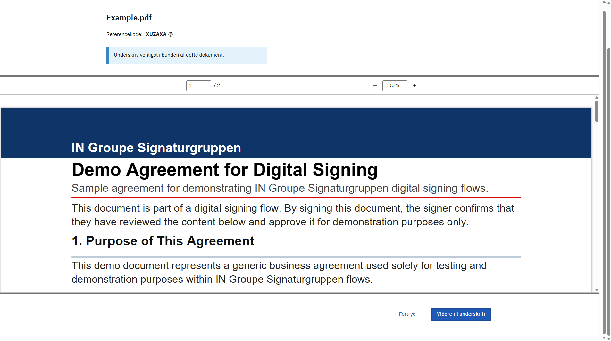
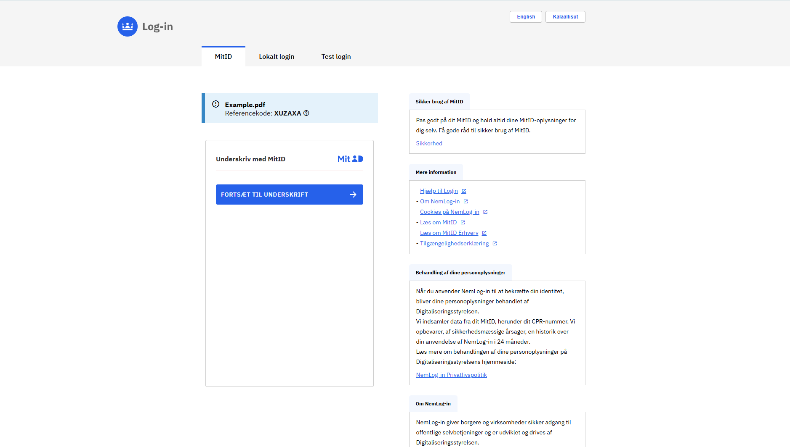
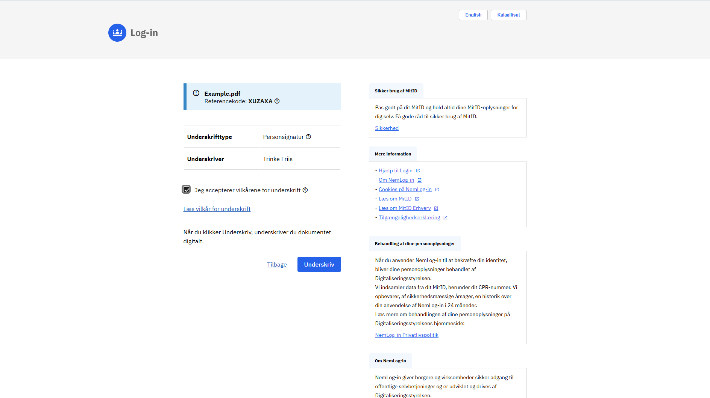

# NemLog-in3 qualified signing

Nemlog-in3 qualified signing can be invoked using [Workflow API](https://signaturgruppen-a-s.github.io/signaturgruppen-broker-documentation/enterprise/workflow-signing.html).

Refer to the linked documentation for instructions on how to authenticate and work with the Workflow API.

It is assumed that the user has a general understanding of how the Workflow API functions.

A few differences exists between using Workflow API using Signaturgruppen Broker and Workflow API using Nemlog-in3 qualified signatures.

 - a few minor changes to API calls
 - a major change to how signtext_id is handled.

 These changes will be addressed below.

## Technical usage

To initiate a workflow with Nemlog-in3 qualified signatures, a few API calls must be replaced with the corresponding Nemlog-in3 qualified signing variant.

These are:

- Creating the workflow. 
- Creating the signtext_id.

After creating the signtext_id. A different approach is used to initiate the signing process.

### Create workflow (Nemlog-in3)
Create workflow:
```
POST /api/workflows/{cvr}/nemlogin
```

| Parameter | Description |
|--------| --------|
| **title**       | Workflow title |
| **documentFormat**    | Format of input documents. PDFList or single set of XML+XSLT are supported | 
| **pdfList:title**      | Title of PDF |
| **pdfList:pdfBase64**       | Base64 encoded bytes of PDF |
| **xmlData:title**      | Title of XML |
| **xmlData:xmlB64**   | Base64 encoded bytes of XML |
| **xmlData:xsltB64**   | Base64 encoded bytes of XSLT |
| **expiresAt**       | Expiration of workflow |

### Sign
When starting a new signing flow / adding a signature, first retrieve a SigntextID from the Workflow API:
```
POST /api/workflows/{cvr}/nemlogin/signtextid
```

| Parameter | Description | Options | Default |
|--------| --------| --------| --------|
| **workflowId**       | Workflow ID. | | |
| **preferredLanguage**      | Optional. The preferred language disaplyed in the Nemlog-in3 signing flow | da, en | da |
| **ssnPersistenceLevel**       | Optional. Persistance level of the included signature. | Session, Global | Global |
| **signatureFormat**       | Optional. Format of resulting signature. | PAdES, XAdES | PAdES |
| **acceptedCertificatePolicies**   | Optional. Determines what type of identity is accepted. Leave empty to accept any | Person, Employee, Organization | |

The response of this request will contain an "iframeUrl". This should be embedded in an iframe. Note that the iframe will need the full page size to display correctly.

Apart from these two endpoints that replaces the standard create workflow and create signtextid endpoints:
 - POST /api/workflows/{cvr}
 - POST /api/workflows/{cvr}/signtextid

 All other endpoints are valid to be called with a Nemlog-in3 workflow.

### Result
The result is automatically saved by Signtext Api. 

When the signing flow terminates, a webmessaging object is returned to the parent of the iframe. The object will look like the following:
  
  ```
     [
       command: 'complete' | 'error' | 'cancelSign',
       message: 'some text...'
     ]
  ```

The commands available are:
 | Name | Description | Message |
 | ---- | ----------- | ------- |
 | **complete** | Returned if successful | <Empty> |
 | **error** | Returned if unsuccesful | Contains error message if available |
 | **cancelSign** | Returned if user clicks on cancel | <Empty> |

An eventlistener should be created on the page where the nemlogin iframe is created. An example could be:

```
async function nemloginHandler(event) {
    console.log("nemloginHandler received event: " + event.data.command + ", from origin: " + event.origin);
    if (event.data.command === "complete") {
        // Success
    }
    if (event.data.command === "error") {
        // Error. Note that error message is technical and is not meant for end user
    }
    if (event.data.command === "cancelSign") {
        // Cancelled
    }

    window.removeEventListener("message", nemloginHandler);
}

window.addEventListener("message", nemloginHandler);
```


### Signatures
After a user finishes the signing process, the response is returned to Signtext API, and can be accessed by calling GetWorkflow on the workflow in question. The information is extracted from the response containing the AdES returned by Nemlog-in3.

The extracted claims are:

| Name | Value |
|--------| --------|
| **idp**       | Is always nemlogin_qualified_signature |
| **idpId**    | Contains the respective id in the idp. Here it is Nl3UUID | 
| **nl3Uuid**      | UUID of the user. Can either be the global or a session-based UUID |
| **nl3Name**       | Name found on the user in the response |
| **signatureType**      | Can be either: QualifiedSignature or OcesSignature |
| **authTime**   | Time of signing |

### Nl3 Ades
To retrive the list of AdES documents associated with a Nemlog-in3 workflow. The following should be called:
```
GET /api/workflows/{organizationTin}/nemlogin/{workflowId}/nl3signatures
```

This responds with a JSON structure containing the signatures and AdES documents associated in base64.

## Visual walkthrough



